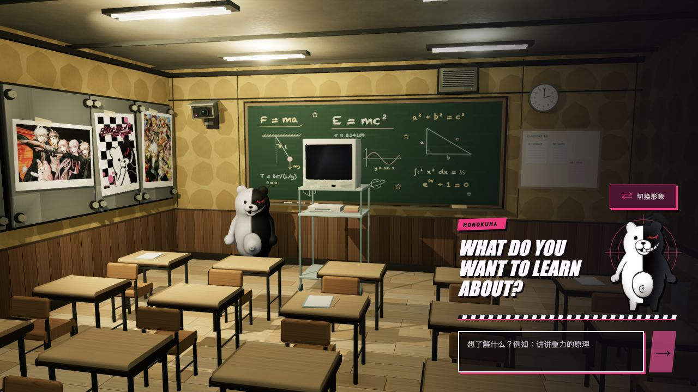

# AI Live Classroom · AI 在线课堂

中文交互的 AI 视频课堂：输入主题，由模型编写教案，再逐段生成讲解视频，在可交互的 3D 教室中播放。支持角色选择、30 秒开场和最多两次 10 秒续讲。

## 项目来源与接入状态

本项目基于 [internetphysics/live-classroom](https://github.com/internetphysics/live-classroom) 的 MIT 代码（基础提交 `5a07110fa4e0b3dc4db0eab842bc6e0cf4169de4`），由 LerSent001 整理发布中文交互与课堂视觉修改版，保留原始许可和署名。

**TokenPay / TokenDance 接入正在筹备，尚未实现或完成扣费联调。** 当前代码仍使用部署者的 Gemini 与 fal Key；不要将当前版本当作已经具备用户钱包隔离、登录鉴权或生产计费能力的公共服务。下面的部署说明适用于自用开发实例。

计划通过 TokenDance 专属 API Key 授权，让用户使用自己的钱包余额生成教案和视频，不接入观猹用户资料 OAuth2。详见 [TokenDance 合作接入信息](docs/tokendance-integration.md)。

应用标识 App URL：`https://github.com/LerSent001/ai-live-classroom`（不带尾斜杠）。仓库地址用于应用归因，不是可运行的网站或授权回调地址。

代码使用 MIT 许可；第三方角色与视觉素材的权利不由 MIT 许可覆盖，来源和限制见各素材目录的 `SOURCE.md`。发布此仓库不代表取得这些角色的商业使用许可。

## 现有功能与本地运行

A TV channel that teaches whatever you type. Gemini plans an initial 30-second lesson as six five-second
beats, MiniMax H3 Max Turbo renders each beat as a retro 1970s educational cartoon scene just before it airs, and
the clips play on a CRT inside a 3D classroom with a program guide for queueing what's next.



This local visual variant uses Monokuma in a Japanese classroom with Danganronpa-inspired black, white,
and magenta interface graphics. The UI floats directly over the scene without enclosing cards.
The button above the lobby portrait switches between Monokuma (default) and Monomi before starting.
The selected identity controls the UI portraits, Gemini planning, H3 character sheet and voice,
and is recorded as `teacherId`. Both follow-ups inherit that identity; switching alone never generates a clip.
Generated videos retain the upstream 1970s American educational cartoon style: flat cel paint,
slightly boiling ink outlines, muted warm scenery, paper grain, and faded 16mm film texture.
The teachers retain their own black/white or pink/white colors. The surrounding classroom UI keeps its Danganronpa design.
A black/white/magenta loading screen covers asset loading and the first rendered frames. A short
entrance camera move then settles into the original lobby composition before showing the controls.
Drag the classroom canvas to look left or right, limited to 15 degrees each way. Input fields and
TV controls keep their own pointer behavior; reduced-motion preferences skip the entrance move.
The room uses locally authored bolted steel panels, a surveillance camera, a broadcast speaker,
ochre plaster, and dark timber wainscoting. The supplied photos keep their full images and white print borders.
Teacher identity, portrait paths, voice, and the short numbered character sheet are defined in
`src/lib/classroom-config.ts`. Keep character-sheet lines short: the provider's prompt rewriter
preserves numbered lists more reliably than prose. Asset provenance is recorded in
`public/characters/monokuma/SOURCE.md`, `public/characters/monomi/SOURCE.md`, and `public/models/monokuma/SOURCE.md`.

## Run it

Requirements: Node 22.6+ (`.nvmrc`), a [fal.ai](https://fal.ai) key scoped to `minimax/h3-max-turbo/image-to-video`, and a Gemini key.

```bash
npm install
cp .env.example .env.local   # then fill in FAL_KEY and GEMINI_API_KEY (both required)
npm run dev                  # http://localhost:3000
```

Type a topic in Chinese or English (2–500 characters), press enter, and the TV tunes in.
Chinese requests default to Mandarin narration, Chinese captions, and Chinese follow-up questions;
an explicit requested narration language takes priority. IME confirmation does not submit a lesson.
**Every lesson costs real money** — see below —
so the app never starts a lesson without you typing one.

### Keys

| Key | Used for | Required |
|---|---|---|
| `FAL_KEY` | Video rendering via `minimax/h3-max-turbo/image-to-video` only | yes |
| `GEMINI_API_KEY` | One `gemini-3.1-flash-lite` planning request for each selected lesson | yes |

Keys stay on the server in the git-ignored `.env.local`. There is no fal LLM fallback or
AI-generated end-card request. Restart the server after changing keys.

If the shell already exports `HTTP_PROXY` / `HTTPS_PROXY`, use `npm run dev:proxy` or
`npm run start:proxy` so Node's provider requests use that proxy. These commands require
Node 22.21+ or 24.5+; keep localhost in `NO_PROXY`. Ordinary `dev` / `start` use the default
Node network configuration.

### Short demo and cost

The initial lesson is **30 seconds**. Select up to **two 10-second follow-ups**, one at a time.
Suggestions alone create no requests, and the end card waits for a selection without a countdown.
The server enforces these limits even when requests are sent outside the UI.

The complete path contains **ten five-second 768p clips (50 seconds total)**. At the advertised
launch rate of $0.01/second, the fal estimate is **$0.50**. Gemini charges are separate and depend
on the Gemini account. The [official pricing page](https://fal.ai/models/minimax/h3-max-turbo/image-to-video)
advertises a discount ending September 7; the app conservatively blocks new planning and rendering
from September 7, 2026 at 00:00 UTC until pricing and budget are reviewed. This cutoff is local policy,
not a published provider cutoff time. Estimates are not a live balance check; fal billing is authoritative.

This endpoint [allows `image_url` to be omitted](https://fal.ai/models/minimax/h3-max-turbo/image-to-video/api).
The app uses that documented text-only mode with its default 16:9 output. It does not call the
separate text-to-video endpoint, upload an initial image, or request unsupported `aspect_ratio` input.

A paid submission is sent exactly once, including on transport errors. The SDK retries its queue
POST internally, so `h3-request.ts` submits directly and uses the SDK only to read that request's
status and result. On failure, no new clips or queued lessons are submitted; already accepted
concurrent requests can still finish. Local recap cards keep failed beats inspectable.
The estimate ceiling is 98 cents per worker; the 30/10/10 limit bounds one demo to 50 cents at the
configured rate. Starting another demo spends again and does not share an account-wide budget ledger.

`SAVE_RECORDINGS=1` (the default) records selected topics and their parent/child sessions, exact
Gemini and fal request bodies, public planner output and token counts, validated scripts, fal request
IDs, timings, results, and failures in `recordings/<sessionId>/events.jsonl`. It writes intent before
provider submission. A `video-request` alone does not prove fal accepted a request; use
`video-submitted` and its request ID. A network failure can leave acceptance unknown; never auto-resubmit.

Successful provider results also get `scene-NN.json` **before** downloading `scene-NN.mp4`.
A download failure preserves the result URL and metadata and adds `video-save-failed`; `video-saved`
confirms the local file finished writing. Disk-write failures are reported and prevent further
submissions. Already accepted requests still finish if a subsequent metadata write fails.
Auth headers, API keys, and thinking text are excluded. Actual billed cost stays `null` until it is
checked against provider billing. The folder is git-ignored. These are durable records, not automatic
runtime recovery or deterministic video reproduction. Private recordings and local work logs are not distributed with this repository.

## How it works

```
topic ──► planner (Gemini) ──► 6 beats ──► H3 Max Turbo, just in time ──► runway ──► CRT in the classroom
                                                 ▲                                    │
                                                 └──── program guide queues the next lesson ◄──┘
```

- **Planning** (`src/server/lesson-producer.ts`) makes one LLM call that writes narration and a
  visual beat for all six initial scenes or two follow-up scenes. There is no per-scene LLM call.
- **Rendering** (`src/server/fal.ts`, `classroom-runtime.ts`) keeps a small runway of clips ahead
  of playback: two clips must be decoded before the lesson starts, then production stays two to
  four scenes ahead and recovers toward six after an underrun. Two renders run concurrently.
- **Prompts** (`src/lib/classroom-config.ts`) are written for fal's prompt rewriter, not the video
  model: H3 Max always paraphrases the prompt before rendering, and long prose descriptions lose
  details every scene. The teacher is therefore a ten-line numbered character sheet the
  rewriter copies verbatim. `compileH3ScenePrompt` assembles sheet + scene + voice + style.
- **Playback** (`src/components/lesson-deck.tsx`) assigns fal's CDN URLs straight to reusable
  `<video>` elements, holds the first frame until it is painted, and layers the tuning static,
  colour bars, and sign-off card on top. One soundtrack loops continuously across lessons.
- **Playlist** (`classroom-playlist-runtime.ts`) runs queued lessons as child sessions that share
  one playback runway, so the next lesson is already rendering while the current one airs. If
  nothing is queued, the sign-off card waits. Only a manually chosen follow-up is planned and
  rendered; the server accepts at most two follow-ups in the entire demo.
- **The set** (`src/components/set/`) is hand-built with react-three-fiber: procedural textures,
  furniture, the CRT and AV cart, and set dressing.

## Deploying

There is no database, queue, or separate worker process — the lesson runtime is an in-memory
singleton inside the Next.js server, and fal is called over HTTPS. That means it runs anywhere a
single long-lived Node process runs (`npm run dev`, or `npm run build && npm start` on a VM,
Fly, Railway, etc.) and it does **not** work on serverless platforms: on Vercel-style deployments
each invocation gets a fresh process, so sessions and in-flight renders evaporate between requests.
Recordings also write to the local filesystem. One process, one disk.

## Prompt debugging

The single most useful thing to know: look at what fal *actually* rendered from, not what you sent.

```bash
node scripts/expanded-prompts.mjs <sessionId>               # rewritten prompt per scene + which
                                                            # character-sheet lines survived
node --experimental-strip-types scripts/probe-h3-expansion.mjs ["beat"] ["line"]
                                                            # render ONE clip (paid) with the current
                                                            # prompt and print its expansion
node scripts/probe-planner-narration.mjs "topic"            # one paid Gemini call, flag narration
                                                            # that breaks character
```

Session ids appear in the dev-server log; `recordings/<sessionId>/scene-NN.json` holds the same
data for finished lessons.

## Scripts

| Command | What it does |
|---|---|
| `npm run dev` / `build` / `start` | Next.js app |
| `npm run typecheck`, `lint`, `test` | Static gates CI runs |
| `npm run verify` | No-spend smoke test against a production build (run `npm run build` first) |
| `npm run soundtrack` | Regenerates the classroom loop in `public/audio/` |
| `node scripts/generate-teacher-sprite.mjs <reference> [monokuma\|monomi] [flatten]` | Generates a sprite draft for the selected teacher, preserving original portrait assets (OpenAI Images, paid) |
| `node scripts/generate-posters.mjs [monokuma\|monomi]` | Regenerates posters using the selected teacher (OpenAI Images, paid) |

## Layout

```
src/app/                 Next.js routes (page, /api/classroom)
src/components/          classroom.tsx (lobby + program guide), lesson-deck.tsx (the TV), set/ (3D)
src/hooks/               polling client, continuous soundtrack
src/lib/                 config + prompts, types, boundary parsing
src/server/              planner, fal client, lesson runtime, playlist runtime, archiving
scripts/                 generators and prompt-debugging probes
```

## License

Application code is MIT. Monokuma and Danganronpa belong to Spike Chunsoft. Character assets are
third-party fan-project assets; see the asset-specific source records above for the licensing boundary.
