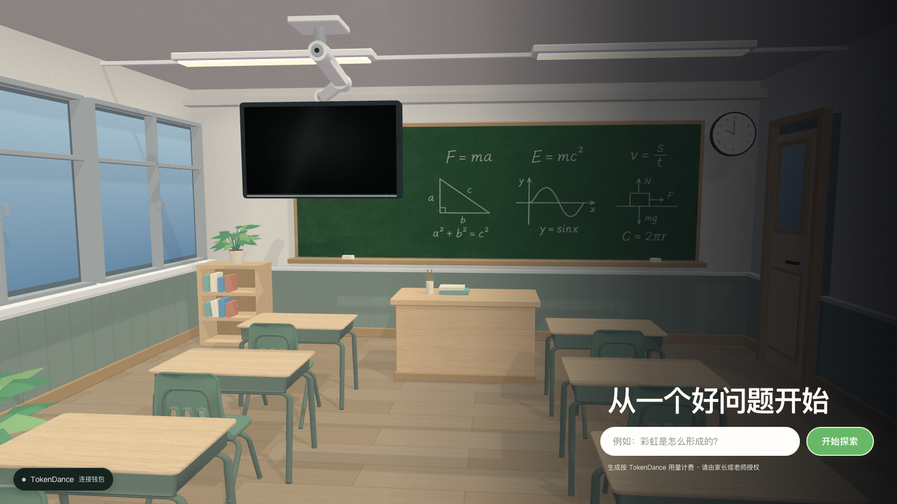

# 中文课堂 · Live Classroom

输入自己的问题，在轻量 3D 教室中观看中文视频讲解。**中文课堂是 `main` 主版本和默认首页**；不按幼儿园、小学、初中、高中分类，讲解深度由问题内容与明确要求决定。



## 版本

- **`main`**：中文课堂，六套桌椅、公式黑板、固定悬挂机械臂屏幕，无角色、口号或室外场景。首页 `/`；原 `/zh-youth` 地址继续可用。
- **[旧版快照 `2cd7d47`](https://github.com/LerSent001/ai-live-classroom/tree/2cd7d47ad0e7d8f4fd13970df5dac03068b4ed23)**：可从历史提交取回切换前的主版本，黑白熊风格不再作为主要版本。原来的 `codex/integrate-courseware` 分支也不受影响。
- 本地兼容 Demo：`/styles/monokuma`，不出现在默认入口。脚本同样使用 TokenDance DeepSeek 4.1 Flash（关闭思考），钱包与会话仍与主课堂隔离；旧 Demo 的 fal 视频链路不变。参考 [旧版说明](README.monokuma.md)。

## 本地运行

需要 Node.js 22.6+。

```bash
git clone https://github.com/LerSent001/ai-live-classroom.git
cd ai-live-classroom
npm ci
cp .env.example .env.local
npm run dev
```

打开 `http://localhost:3000`。浏览教室无需模型密钥；开始生成前，在页面连接自己的 TokenDance 钱包。主版本不需要公共模型 Key；旧 Gemini 接口、模型配置及项目内 Key 已移除，没有自动回退。

生产预览：

```bash
npm run build
npm start
```

## 钱包与课程

规划使用 TokenDance 的 `deepseek-v4.1-flash`，显式关闭深度思考；三题完整脚本实测平均约 6.34 秒，详见[测试记录与局限](docs/youth/deepseek-fast-planner.zh-CN.md)，不保证所有请求均在 10 秒内完成。视频使用其 MiniMax V2 `minimax-h3-max`。开场 30 秒，由六段 5 秒视频组成；最多手动选择两节 10 秒续课。不会自动选择问题或自动重提付费任务。

内容模型按 [2026-09-22 文本对比](docs/youth/planner-comparison.zh-CN.md) 及关闭思考实测选择；此次仅测试课程脚本，没有生成视频。本工作区两个风格共用同一脚本适配器，但不会共用访客钱包；不改其他 Git 分支或历史生成记录。

- 每位访客使用自己的 TokenDance 授权，不共用站长的模型 Key。
- 浏览教室、展开钱包不会提交生成。点击开始或手动选择续课后可能计费；实际金额以平台账单为准。
- 每节付费课程在提交脚本前读取人民币价格和余额，保守覆盖该节全部片段、脚本上限与 10% 余量；预检失败不提交。它不是平台原子冻结，不能保证钱包被其他应用同时消费时仍足够。
- 中文课堂等本节全部片段就绪后起播；已手选的续课可在后台完成，仍最多两个视频任务并发。刷新接回当前片段，加载失败可只重载视频，退出停止新提交但不撤销已受理任务。
- Key 经服务端保存为加密文件，不返回浏览器，不写入 localStorage、日志或 Git。加密密钥同样在服务器上，站长必须保护服务器和备份。
- 各浏览器的钱包、会话和录制相互隔离；丢失身份 Cookie 后不能直接恢复旧录制。
- 已验证真实钱包及文本脚本请求；视频生成链路和逐笔账单未做此次验收。自动测试中的钱包金额和播放视频均为模拟数据。

详见 [TokenDance 接入与安全边界](docs/youth/tokenpay-integration.zh-CN.md)。

## 部署与在线体验

**GitHub 仓库地址不是在线课堂地址。当前尚未配置公共运行服务器。**

完整体验需要一个长期运行的 Node.js 服务、HTTPS 和持久化存储，并保持 **单实例**。授权流程仍在内存里；已录制课程可在原浏览器加载钱包后重建运行态，只查询原视频任务编号、补存成片，不重新提交。重启后的播放从已保存片段重新开始，不保证保留秒级进度；缺失脚本、任务编号或从未提交的片段不能凭空恢复。

GitHub Pages 只能托管静态网页，不能直接运行本项目的钱包接口、规划与生成任务。不要把前端上传成功当作完整课堂已上线，也不要将访客 Key 搬到公开页面来绕过后端。

可部署到支持常驻 Node 服务的平台或自己的服务器。设置 `TOKENPAY_PUBLIC_URL` 为实际 HTTPS 访问域名，保护并持久化 `.youth-tokenpay/` 和 `.youth-recordings/`。中文付费生成要求开启录制；关闭 `SAVE_RECORDINGS` 时只允许浏览与已有录播。不要把这些目录放进 `public/`。

## 性能

- 默认按需渲染，镜头停稳后不维持 WebGL 动画循环；正常视频由 DOM 播放。
- 场景约 40,072 三角形、27 次常规绘制；六套桌椅合批，DPR 上限 1.25。
- 初始化后缓存主阴影，接触阴影仅计算一次；无逐帧 AO、后处理、骨骼或机械臂物理。
- 墙面、木纹和公式共用一张约 80 KB 图集。无室外模型，不透明蓝色玻璃。

这些是代码预算与受控测试结果，不是对所有 MacBook Air 的温度或续航保证。

## 验证

```bash
npm run typecheck
npm run lint
npm test
npm run build
npm run verify
```

`verify` 用空密钥和匿名钱包检查免费路径，不调用真实生成。浏览器脚本位于 `scripts/verify-youth-browser.cjs`，只使用隔离上下文和本地模拟片段。不要为了测试擅自连接真实钱包或提交付费课程。

恢复回归另见 `scripts/verify-youth-recovery.cjs`：后台 Chromium、本地编码媒体、拦截所有课程提交、屏蔽外部请求，覆盖 11 个桌面/手机场景，包括最后一段刷新、加载失败重载/退出、提交回执丢失、播放回执延迟、服务重启、自动播放受限、存储受限、短暂媒体连接失败和播放确认挂起。网络确认只重试同一个应用命令编号；视频提供方的生成 POST 不重试。

`scripts/verify-youth-flow.cjs` 使用真实课堂运行态及临时录制目录，脚本、余额、视频提供方完全模拟，播放本地编码媒体；覆盖提交问题、30 秒开场、手选两次 10 秒续讲、10 段连续播放和两任务并发。两类验证都不代表真实付费视频或逐笔扣费验收，不连接用户钱包。人物仍按黑白熊旧流程，用编号角色表、声音与风格文字约束，不传首帧或身份参考图。

中文主课堂的新开场由 DeepSeek 在一次响应中选择 15 / 20 / 25 / 30 秒，并写出对应的 3 / 4 / 5 / 6 段五秒分镜、台词和动作；不再强制六段。续讲仍为用户手选的 10 秒。开始前按 30 秒上限核验余额以避免中途缺钱，规划完成后预算预留缩减到实际时长；预留不是平台冻结或实际扣费，只提交规划中必要的镜头。旧录制保留原时长，不裁切。

有本地历史录制时，可运行 `node --import tsx scripts/verify-cached-classroom.cjs`，使用原脚本及十段真实 MP4 走原生录播 API，覆盖连续播放、两次续讲及返回输入页，不提交生成。`YOUTH_CACHED_MEDIA=1 YOUTH_OPENING_SECONDS=15`（也可选 20、25）配合 `node --import tsx scripts/verify-youth-flow.cjs`，使用这些真实缓存视频作为播放测试素材、模拟规划和生成，检查短课程控制流；不把旧素材冒充新的短课程生成结果。历史录制不会上传到 Git。

## 来源与许可

基于 [internetphysics/live-classroom](https://github.com/internetphysics/live-classroom)，保留原作者 [MIT 许可](LICENSE)。

中文场景桌椅来自 Ethan Place / Poly Haven，采用 CC0；建筑、门窗和电视臂为本项目低模，表面图像及处理方式见 [资产来源](public/youth/SOURCE.md)。不宣称整套场景来自开源模型库。

黑白熊、莫奈美及相关游戏角色不是本项目原创。旧风格资产的来源记录不等于独立开放素材许可，不能因为代码是 MIT 就认为角色资产也是 MIT；主入口不加载这些资源。
